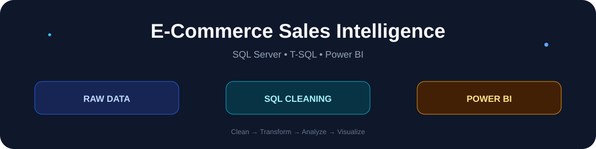
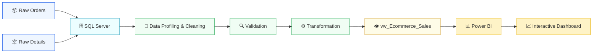

<div align="center">



# 🛒 E-Commerce Sales Intelligence

### SQL Server + T-SQL + Power BI

<p>


</p>

**Raw Data → SQL Cleaning → SQL Transformation → Analytics View → Power BI**

</div>

---

## 🚀 Project Overview

**E-Commerce Sales Intelligence** is an end-to-end business analytics project that separates the data preparation layer from the visualization layer.

### 🧹 SQL Server

SQL is responsible for:

- Data profiling
- Missing-value checks
- Data-type conversion
- Text cleaning
- Duplicate detection
- Invalid-value validation
- Data transformation
- KPI preparation
- Analytics-ready SQL view

### 📊 Power BI

Power BI is responsible for:

- Interactive dashboard
- KPI visualization
- Sales analysis
- Profitability analysis
- Category analysis
- State-level analysis
- Payment-mode analysis
- Customer analysis
- Time-based analysis

---

## 🔄 End-to-End Architecture



---

## 🧹 SQL Data Cleaning Layer

The SQL pipeline works with the project's two core datasets:

```text
Orders
├── OrderID
├── OrderDate
├── CustomerName
├── State
└── City

Details
├── OrderID
├── Amount
├── Profit
├── Quantity
├── Category
├── Sub-Category
├── PaymentMode
└── AOV
```

### Cleaning operations

| Operation | SQL technique |
|---|---|
| Remove surrounding spaces | `LTRIM()` / `RTRIM()` |
| Handle blanks | `NULLIF()` |
| Convert dates | `TRY_CONVERT(DATE, ...)` |
| Convert money/numbers | `TRY_CONVERT(DECIMAL, ...)` |
| Convert quantity | `TRY_CONVERT(INT, ...)` |
| Detect duplicates | `ROW_NUMBER()` |
| Join datasets | `INNER JOIN` |
| Create metrics | `CASE WHEN` |
| Create BI source | SQL `VIEW` |

---

## ⚙️ Transformation Layer

The final SQL view is:

```sql
dbo.vw_Ecommerce_Sales
```

It combines the cleaned Orders and Details datasets and creates additional analytical fields.

### Derived fields

```text
OrderYear
OrderMonth
OrderQuarter
AOV
ProfitMarginPct
```

### Example

```sql
CASE
    WHEN d.Amount > 0
    THEN CAST(
        (d.Profit / d.Amount) * 100.0
        AS DECIMAL(10,2)
    )
    ELSE NULL
END AS ProfitMarginPct
```

---

## 📊 Power BI Intelligence Layer

The Power BI dashboard can use the SQL view as its primary analytical source.

### Key KPI areas

| KPI | Business purpose |
|---|---|
| 💰 Total Sales | Revenue performance |
| 📈 Total Profit | Profitability |
| 📦 Total Quantity | Product volume |
| 🧾 AOV | Average order value |
| 📊 Profit Margin | Efficiency |
| 🗺️ State Sales | Geographic performance |
| 🏷️ Category Sales | Product performance |
| 💳 Payment Mode | Customer payment behavior |

---

## 🔍 Business Questions

<details>
<summary>💰 Sales Intelligence</summary>

- What is total sales?
- Which categories generate the most revenue?
- Which states generate the highest sales?
- How does sales change over time?
- Which customers generate the most revenue?

</details>

<details>
<summary>📈 Profitability Intelligence</summary>

- Which categories generate the highest profit?
- Which sub-categories have weaker profitability?
- What is the overall profit margin?
- Which regions contribute the most profit?

</details>

<details>
<summary>💳 Customer & Payment Intelligence</summary>

- Which payment modes are most used?
- Which customers have the highest sales?
- How does quantity vary by category?
- What is the average order value?

</details>

---

## 🛠️ Technology Stack

```text
SQL Server
   └── T-SQL
       ├── Data Profiling
       ├── Data Cleaning
       ├── Validation
       ├── Transformation
       └── SQL Views

Power BI
   ├── Data Connection
   ├── Data Modeling
   ├── DAX Measures
   └── Interactive Dashboard
```

---

## 📁 Repository Structure

```text
E-Commerce-Sales-Intelligence/
│
├── README.md
├── project-banner.svg
│
├── sql/
│   └── E-Commerce_Sales_Intelligence_SQL_Data_Cleaning.sql
│
└── powerbi/
    └── E-Commerce Sales Intelligence.pbix
```

---

## 🚀 How to Run

### Step 1 — Create the SQL database

Open SQL Server Management Studio and run:

```sql
E-Commerce_Sales_Intelligence_SQL_Data_Cleaning.sql
```

The script creates:

```text
ECommerceSalesIntelligence
```

### Step 2 — Load the source data

Load the original Orders and Details CSV files into the staging tables.

Update the `BULK INSERT` paths in the SQL file before running them.

### Step 3 — Run the cleaning pipeline

The script performs:

```text
Raw Data
   ↓
Profiling
   ↓
Cleaning
   ↓
Validation
   ↓
Transformation
   ↓
Analytics View
```

### Step 4 — Validate

```sql
SELECT TOP 100 *
FROM dbo.vw_Ecommerce_Sales;
```

### Step 5 — Connect Power BI

```text
Power BI Desktop
      ↓
Get Data
      ↓
SQL Server
      ↓
ECommerceSalesIntelligence
      ↓
dbo.vw_Ecommerce_Sales
```

---

## 🧠 SQL Skills Demonstrated

```text
✓ SQL Server
✓ T-SQL
✓ Data Profiling
✓ Data Cleaning
✓ NULL Handling
✓ Data-Type Conversion
✓ Duplicate Detection
✓ CASE WHEN
✓ TRY_CONVERT
✓ NULLIF
✓ LTRIM / RTRIM
✓ ROW_NUMBER
✓ PARTITION BY
✓ INNER JOIN
✓ GROUP BY
✓ Aggregate Functions
✓ Derived Metrics
✓ SQL Views
✓ Data Validation
```

---

## 🎤 Interview Explanation

<details>
<summary><b>▶ How to explain this project in an interview</b></summary>

<br>

> **“E-Commerce Sales Intelligence is an end-to-end SQL and Power BI analytics project. I used SQL Server as the data preparation layer and Power BI as the business intelligence layer.**
>
> **First, I loaded the Orders and Details data into SQL staging tables. I profiled the data, checked missing values, cleaned whitespace, converted dates and numeric fields, validated quantities and amounts, and handled duplicate records.**
>
> **Then I joined the cleaned datasets and created derived metrics such as AOV and profit margin. I exposed the final analytics-ready dataset through a SQL view called `vw_Ecommerce_Sales`.**
>
> **Finally, I connected Power BI to that SQL view and used it to build an interactive dashboard for sales, profit, quantity, category, state, payment-mode and customer analysis.”**

</details>

---

## 💼 Resume Version

### E-Commerce Sales Intelligence | SQL Server + Power BI

> Built an end-to-end e-commerce analytics solution using SQL Server and Power BI. Performed data profiling, cleaning, validation and transformation using T-SQL; handled missing values, duplicates and data-type inconsistencies; created derived metrics including AOV and profit margin; developed an analytics-ready SQL view and connected it to Power BI for interactive sales and profitability analysis.

---

## ⭐ Why This Project Matters

This project demonstrates the complete analytics workflow:

```text
DATA
 ↓
CLEAN
 ↓
VALIDATE
 ↓
TRANSFORM
 ↓
ANALYZE
 ↓
VISUALIZE
 ↓
BUSINESS INSIGHTS
```

It therefore demonstrates more than simply creating a Power BI dashboard — it shows a **SQL → BI analytics workflow**.

---

<div align="center">

### 🧹 SQL prepares the data.
### 📊 Power BI turns the data into intelligence.

**E-Commerce Sales Intelligence**

</div>
